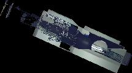
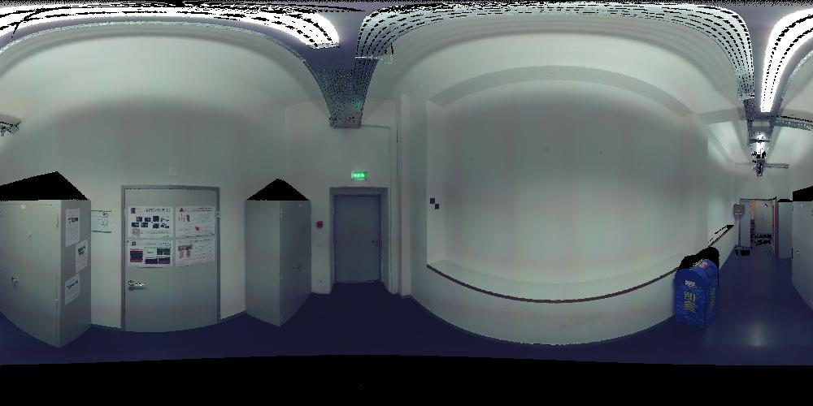
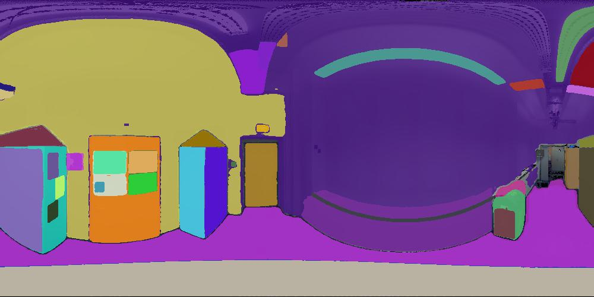
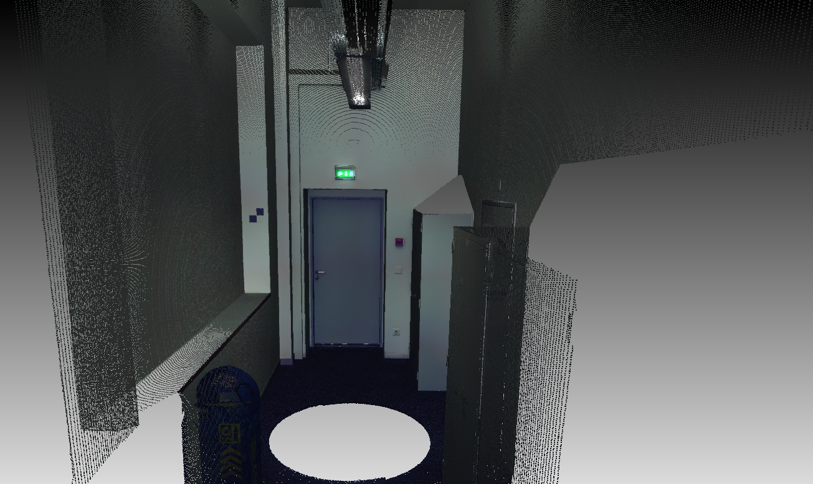
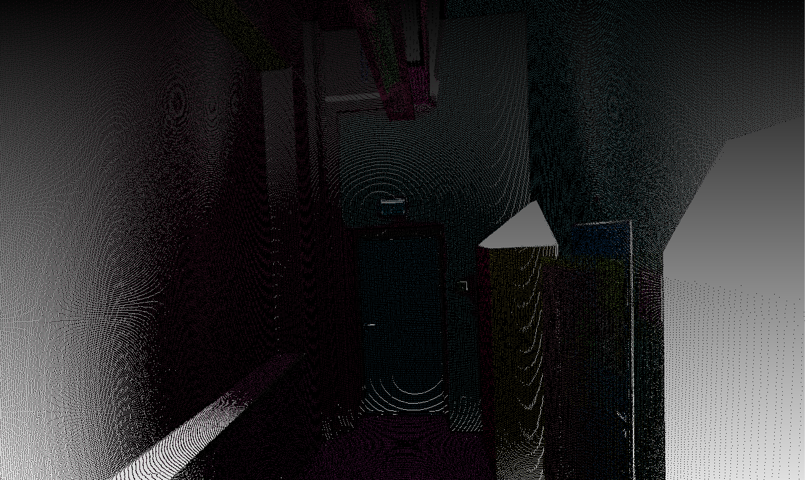

# Point Cloud Unsupervised Segmentation using pretrained SAM

## Installation
```bash
pip install torch==2.0.0+cu118 torchvision==0.15.1+cu118 torchaudio==2.0.1+cu118 --index-url https://download.pytorch.org/whl/cu118
pip install git+https://github.com/facebookresearch/segment-anything.git
```


## Steps

```bash
python main_segment.py
```

Segmented pointcloud is saved as 'segmented_point_cloud.ply'.

### A point cloud can be projected onto 2D plane as a othogonal or spherical projection via a Linear Operator

| Othogonal Projection | Spherical Projection |
|:-------:|:-------:|
|  |  |


### The spherical projection (image) can be segmented with a pretrained SAM


| Spherical Projection| SAM-segmented Spherical Projection |
|:-------:|:-------:|
|  |  |


### The segmented spherical image can be projected back to 3D point cloud via inverse Linear operator


| Original PointCloud| Segmented Point Cloud |
|:-------:|:-------:|
|  |  |

